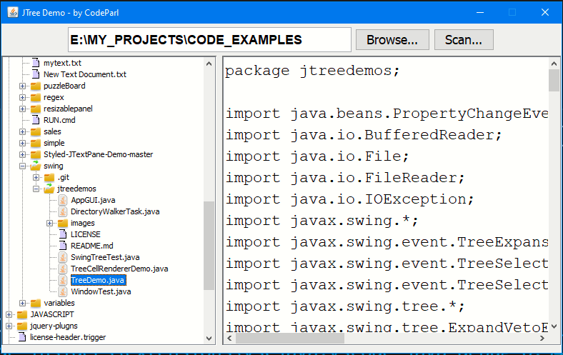

# JTree code example

## code url [https://www.codeparl.com/5B8D7R](https://www.codeparl.com/5B8D7R)

## screenshot

## About this code

This code example shows how to use JTree component in java. A JTree tree component allows you to work with hierarchical data such as displaying a directory and all its sub-directories. I thought of using a recursive method but found it very slow but instead, scanned each sub-directory as the user clicks on a directory to expand it  by using `javax.swing.event.TreeWillExpandListener`.

I used `javax.swing.SwingWorker` to make sure the scanning of a directory doesn't interupt the user while using the application at the same time. I also used `javax.swing.tree.DefaultTreeCellRenderer` to render different files with a custom file icon.

In this code example, I designed a simple GUI invovling textfield to input a directory or folder path, a file browser button, a scan button that allows the user to scan the entire directory for its sub-directories. I also added a textarea so that the user can double-click a file to open it from our directory tree structure.

## How to run this code

To run this code example, simply download the [jdk](https://www.oracle.com/java/technologies/javase-jdk16-downloads.html)  from oracle website and install it on your machine, then install [VSCode](https://code.visualstudio.com/download) and install it, then open the code example in VSCode. You must install java extension before working with this code example in VSCode.

## Author

This code example was writted by [Hassan Mugabo - aka Codeparl](https://github.com/codeparl)

## More code examples

For more code examples, please checkout [codeparl.com](https://codeparl.com)

## License

Licensed under MIT (https://github.com/codeparl/JTree-code-example/blob/master/LICENSE)
